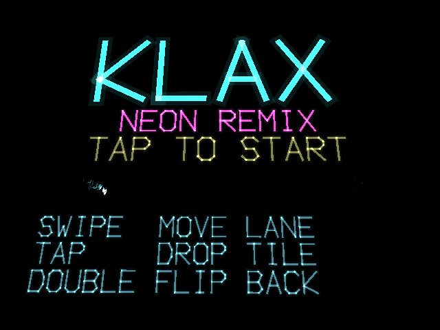
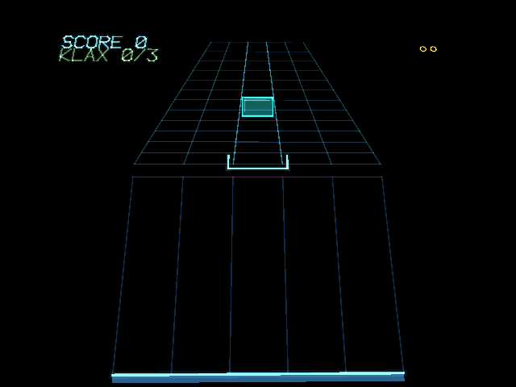

# x3klax

x3klax is a neon remix of the 1990 arcade game Klax for the RayNeo X3 Pro AR glasses. Colored tiles tumble down a conveyor toward the player, who catches them on a paddle and drops them into a well to build lines of three; diagonal lines score the most. The whole board is rendered as glowing wireframe line art tilted back in perspective, so tiles genuinely recede into the distance rather than just shrinking on screen — a deliberate choice for a waveguide display where black is transparent and filled shapes would hang a visible sheet over the real world. Ten waves ramp difficulty primarily by how far apart consecutive tiles can land rather than by speed alone, and every sound effect is synthesized rather than sampled.

## Screenshots

  
  

## Controls

- Swipe to move the paddle one lane
- Tap to drop the bottom tile into the well, or to start/retry on a title or wave-clear screen
- Double-tap to flip the top tile back up the conveyor

## Download

[X3Klax.apk](X3Klax.apk)
